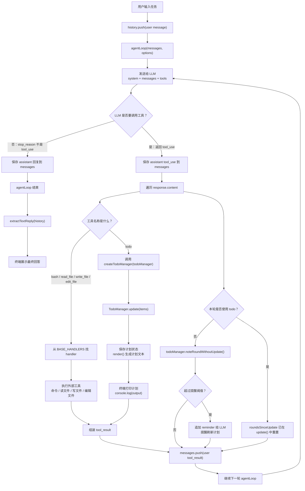

# 03. TodoWrite

## 什么叫 Agent 跑偏？

“跑偏”就是：Agent 原本要完成 A 目标，但在多轮工具调用之后，注意力被中间信息带走，最后做成了 B、漏掉关键步骤，或者一直在局部细节里打转。

比如你让它：

```text
分析 src/core 下所有文件，找性能问题，并写报告。
```

没有 todo 时，它可能这样跑：

```text
1. 读取 agent-loop.ts
2. 发现里面有工具调用逻辑
3. 开始研究 tool dispatch
4. 又去看 tools.ts
5. 发现 bash handler
6. 开始优化 bash handler 的错误提示
7. 忘了还要分析 types.ts
8. 最后也没写完整报告
```

这就叫跑偏。

它不是完全没干活，而是干着干着忘了原始任务的全局结构。

## 为什么会跑偏？

因为 Agent 的本质是：

```text
模型 + 上下文 + 工具循环
```

模型每一轮都会根据当前上下文生成下一步动作。

但上下文里会不断塞进新内容，比如：

- 文件内容
- 命令输出
- 错误日志
- 工具结果
- 模型上一轮自己的回答

信息一多，模型就容易被最近看到的东西吸引。

也就是说，局部信息会压过全局目标。

原始目标是：

```text
分析所有文件，找性能问题，并写报告。
```

但模型刚刚看到 `tools.ts` 里有一个 bash handler，于是它可能开始围着 bash handler 转，忘记还有其他文件没看，也忘记最后要写报告。

这就是多步任务里很常见的问题：不是模型不会做，而是没有一个稳定的外部结构帮它记住“全局任务”。

## 为什么加上任务列表就好多了？

TodoWrite 的作用，是把模型脑子里的计划写到系统里，变成一个稳定、可见、可更新的任务列表。

## LLM AgentLoop 执行图



这张图里最关键的是：`todo` 和其他工具一样，都是 LLM 通过 `tool_use` 调用的工具。

不同点在于，普通工具主要操作外部环境，比如终端和文件；`todo` 操作的是 Agent 自己的会话计划状态。

比如：

```text
[x] 分析 agent-loop.ts
[>] 分析 tools.ts（正在读取文件内容）
[ ] 分析 types.ts
[ ] 写性能问题报告
```

这里：

- `[ ]` 表示还没做，状态是 `pending`
- `[>]` 表示正在做，状态是 `in_progress`
- `[x]` 表示已完成，状态是 `completed`

这样模型每做几步，都能重新看到当前计划。

它就能知道三件事：

- 我最终要完成什么
- 我现在做到哪一步了
- 下一步应该做什么

所以 TodoWrite 不是让 Agent 突然变聪明的魔法。

它更像是给 Agent 一个外置白板。

模型还是那个模型，但原来模糊存在脑子里的计划，现在变成了明确写下来的状态。

这会让 Agent 更不容易：

- 重复做同一件事
- 漏掉某个步骤
- 被某个局部细节带走
- 忘记最后要交付什么

## 一句话总结

跑偏是因为上下文会把模型的注意力带走。

TodoWrite 把目标、进度和下一步固定下来，所以 Agent 更不容易迷路。
