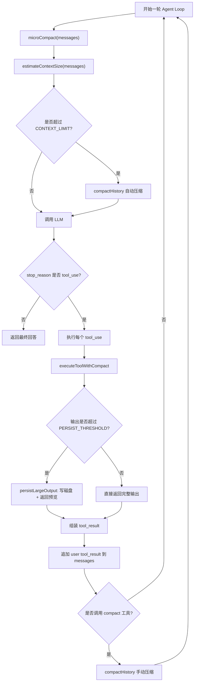

# 06. Context Compact 上下文压缩流程

## 1. 这个 session 要解决什么

Agent 每轮都会把新消息追加到 `messages`：

```text
user request
assistant response
tool_use
tool_result
next assistant response
...
```

如果工具输出很大，或者会话轮次很多，`messages` 会越来越长。上下文压缩要解决的问题是：

```text
不丢掉关键工作状态的前提下，把当前活跃上下文变短，让 Agent 继续工作。
```

在本项目里，s06 使用三层策略：

```text
1. 大工具输出落盘，只把预览放回上下文
2. 旧 tool_result 微压缩，保留最近工作面
3. 整体历史摘要，保存 transcript 后用 summary 替换长历史
```

当前代码位置：

```text
src/core/types.ts
  CompactState

src/persistence/compact.ts
  CONTEXT_LIMIT
  KEEP_RECENT_TOOL_RESULTS
  PERSIST_THRESHOLD
  PREVIEW_CHARS
  TRANSCRIPT_DIR
  TOOL_RESULTS_DIR
  estimateContextSize()

src/sessions/06-context-compact.ts
  当前还是空文件，后续 session 主循环会写在这里
```

## 2. 核心数据结构

`CompactState` 记录压缩状态：

```ts
/**
 * 上下文压缩状态
 * @property hasCompacted 是否已做过完整压缩
 * @property lastSummary 最近一次压缩摘要
 * @property recentFiles 最近碰过的文件，压缩后可用于追踪和重新打开
 */
export interface CompactState {
  /** 是否已做过完整压缩 */
  hasCompacted: boolean;

  /** 最近一次压缩摘要 */
  lastSummary: string;

  /** 最近碰过的文件，压缩后可用于追踪和重新打开 */
  recentFiles: string[];
}
```

三个字段分别解决三个问题：

```text
hasCompacted:
  记录当前会话是否已经发生过完整压缩。

lastSummary:
  保存最近一次压缩摘要，方便调试或后续继续摘要。

recentFiles:
  保存最近读过的文件路径。压缩后如果模型需要恢复细节，可以重新 read_file。
```

## 3. 配置常量

`src/persistence/compact.ts` 里目前已有这些配置：

```ts
/** 上下文上限 */
export const CONTEXT_LIMIT = 50000;

/** 保留最近多少个完整工具结果 */
const KEEP_RECENT_TOOL_RESULTS = 3;

/** 输出超过多少的时候需要写入磁盘 */
export const PERSIST_THRESHOLD = 30000;

/** 预览字符数 */
const PREVIEW_CHARS = 2000;

/** transcript 目录 */
const TRANSCRIPT_DIR = join(WORKING_DIR, ".transcripts");

/** tool results 目录 */
const TOOL_RESULTS_DIR = join(WORKING_DIR, ".task_outputs", "tool-results");
```

含义：

```text
CONTEXT_LIMIT:
  messages 估算长度超过这个值时，触发完整压缩。

KEEP_RECENT_TOOL_RESULTS:
  微压缩时保留最近 3 个完整 tool_result。

PERSIST_THRESHOLD:
  单次工具输出超过 30000 字符时，不直接塞进上下文，而是写入磁盘。

PREVIEW_CHARS:
  大输出落盘后，只把前 2000 字符作为预览放回上下文。

TRANSCRIPT_DIR:
  完整历史归档目录。

TOOL_RESULTS_DIR:
  大工具输出保存目录。
```

注意：`PREVIEW_CHARS = 2000` 是教学版简化策略。它只保留开头，可能漏掉尾部错误信息。更好的实现是 `head + tail + important lines`。

## 4. 总流程

s06 的 Agent Loop 应该长这样：

```text
进入 agentLoopWithCompact
  ↓
每轮开始先 microCompact(messages)
  ↓
估算上下文大小 estimateContextSize(messages)
  ↓
如果超过 CONTEXT_LIMIT，执行 compactHistory()
  ↓
调用 LLM
  ↓
如果模型没有 tool_use，结束
  ↓
如果模型有 tool_use，执行工具
  ↓
工具输出先经过 persistLargeOutput()
  ↓
把 tool_result 追加回 messages
  ↓
如果模型调用 compact 工具，执行手动 compactHistory()
  ↓
继续下一轮
```

流程图：



## 5. 第一层：大输出持久化

### 5.1 触发条件

当某个工具输出超过 `PERSIST_THRESHOLD`：

```ts
if (output.length > PERSIST_THRESHOLD) {
  // 写入磁盘
}
```

典型场景：

```text
bash 执行 rg，输出几千行
npm test 输出巨大错误日志
read_file 读取超大文件
git diff 输出大量 patch
```

### 5.2 做什么

完整输出写入：

```text
.task_outputs/tool-results/<tool_use_id>.txt
```

返回给模型的不是完整输出，而是：

```xml
<persisted-output>
Full output saved to: .task_outputs/tool-results/toolu_xxx.txt
Preview:
前 2000 个字符...
</persisted-output>
```

这样既保存了完整事实源，又避免把巨大输出塞进上下文。

### 5.3 为什么需要预览

如果只告诉模型：

```text
output saved to file
```

模型不知道这个输出大概是什么，下一步很难判断。

所以预览的作用是：

```text
让模型知道输出的类型、开头内容和大致方向。
```

但预览不是完整语义，尤其是错误日志经常在末尾。更稳的预览策略：

```text
前 1000 字符
后 1000 字符
包含 Error/Failed/Exception/WARN 的重要行
完整输出路径
```

## 6. 第二层：微压缩 microCompact

### 6.1 触发时机

每轮调用 LLM 之前执行：

```ts
messages = microCompact(messages);
```

它不需要等到上下文超限，而是持续清理旧工具结果。

### 6.2 压缩规则

收集所有 `tool_result`：

```text
messages 中 role=user 且 content 是数组
  ↓
找到 type=tool_result 的 block
```

如果工具结果数量超过 `KEEP_RECENT_TOOL_RESULTS`，就只保留最近几个完整结果：

```text
最近 3 个 tool_result：保留完整
更早的长 tool_result：替换成占位文本
```

示例占位：

```text
[Earlier tool result compacted. Re-run the tool if you need full detail.]
```

### 6.3 为什么不能压缩最近结果

最近的工具结果通常是当前工作面。

例如：

```text
刚 read_file src/core/tools.ts
下一轮可能马上 edit_file src/core/tools.ts
```

如果刚读完就压缩，模型会失去编辑所需的细节。

所以微压缩只压旧结果。

## 7. 第三层：完整历史摘要 compactHistory

### 7.1 触发方式

完整压缩有两种触发方式：

```text
自动触发：
  estimateContextSize(messages) > CONTEXT_LIMIT

手动触发：
  模型调用 compact 工具，或者用户明确要求压缩上下文
```

### 7.2 完整压缩做哪些事

完整压缩不是截断历史，而是按顺序做：

```text
1. 保存完整 messages 到 .transcripts/
2. 调用 LLM 总结历史
3. 把 focus 追加到摘要里
4. 把 recentFiles 追加到摘要里
5. 更新 CompactState
6. 用一条 summary message 替换旧 messages
```

### 7.3 transcript

压缩前要先保存完整历史：

```text
.transcripts/transcript_<timestamp>.jsonl
```

每行一条 message：

```json
{"role":"user","content":"..."}
{"role":"assistant","content":[...]}
{"role":"user","content":[{"type":"tool_result","tool_use_id":"...","content":"..."}]}
```

这样即使摘要质量不够，原始历史仍然可以追溯。

### 7.4 摘要必须保留什么

摘要 prompt 需要要求模型保留：

```text
1. 当前目标
2. 用户约束和偏好
3. 重要发现和决策
4. 已读文件和已改文件
5. 执行过的重要命令及结果
6. 剩余工作
7. 已知错误和失败尝试
8. 需要重新打开的文件或输出路径
```

坏摘要：

```text
我们讨论了上下文压缩，后面继续做。
```

好摘要：

```text
当前目标：
- 覆盖 docs/06.context_compact.md，写清楚 s06 上下文压缩流程。

已发现：
- compact.ts 当前只有配置和 estimateContextSize。
- 06-context-compact.ts 当前为空，需要后续实现主循环。

相关文件：
- src/core/types.ts
- src/persistence/compact.ts
- src/sessions/06-context-compact.ts
- docs/06.context_compact.md

剩余工作：
- 实现 persistLargeOutput、microCompact、compactHistory。
- 实现 s06 session 主循环。
```

## 8. compact 工具如何设计

`compact` 可以作为一个普通工具暴露给模型：

```ts
export const COMPACT_TOOL_DEFINITION: ToolDefinition = {
  name: "compact",
  description:
    "Summarize earlier conversation so work can continue in a smaller context. Use when the conversation gets too long.",
  input_schema: {
    type: "object",
    properties: {
      focus: {
        type: "string",
        description: "Specific focus to preserve in summary",
      },
    },
  } as ToolInputSchema,
};
```

模型调用示例：

```json
{
  "name": "compact",
  "input": {
    "focus": "保留当前目标、已读文件、未完成实现步骤"
  }
}
```

注意：`compact` 和普通工具不一样。普通工具只返回结果；`compact` 会改变整个 `messages`。

推荐流程：

```text
1. 执行 compact 工具时先返回 "Compacting conversation..."
2. 当前这一轮所有 tool_result 都追加完成
3. agentLoop 检测 manualCompact = true
4. 调用 compactHistory(messages, state, focus)
5. 用摘要替换旧 messages
```

不要在 assistant 的 `tool_use` 之后、对应 `tool_result` 之前压缩。否则可能破坏工具调用结构。

## 9. s06 session 主循环应该怎么写

`src/sessions/06-context-compact.ts` 后续可以实现成这个结构：

```ts
async function agentLoopWithCompact(
  messages: Message[],
  state: CompactState,
  tools: ToolDefinition[],
): Promise<void> {
  const anthropicTools = tools.map((tool) => ({
    name: tool.name,
    description: tool.description,
    input_schema: tool.input_schema as Anthropic.Messages.Tool.InputSchema,
  }));

  while (true) {
    messages = microCompact(messages);

    if (estimateContextSize(messages) > CONTEXT_LIMIT) {
      messages = await compactHistory(messages, state);
    }

    const response = await client.messages.create({
      model: MODEL,
      system: S06_SYSTEM,
      messages,
      tools: anthropicTools,
      max_tokens: 8000,
    });

    messages.push({
      role: "assistant",
      content: response.content as ContentBlock[],
    });

    if (response.stop_reason !== "tool_use") {
      return;
    }

    const results: ContentBlock[] = [];
    let manualCompact = false;
    let compactFocus: string | undefined;

    for (const block of response.content) {
      if (block.type !== "tool_use") continue;

      const output = await executeToolWithCompact(block, state);

      if (block.name === "compact") {
        manualCompact = true;
        compactFocus = String(block.input?.focus || "");
      }

      results.push({
        type: "tool_result",
        tool_use_id: block.id,
        content: output,
      });
    }

    messages.push({
      role: "user",
      content: results,
    });

    if (manualCompact) {
      messages = await compactHistory(messages, state, compactFocus);
    }
  }
}
```

这里有两个重要点：

```text
1. anthropicTools 放在 while 外面，因为 tools 不会在循环中变化。
2. manualCompact 要在 tool_result 追加之后执行，保证工具调用消息结构闭合。
```

## 10. executeToolWithCompact

s06 不应该直接调用工具 handler，而是包一层：

```ts
async function executeToolWithCompact(
  toolBlock: Anthropic.Messages.ToolUseBlock,
  state: CompactState,
): Promise<string> {
  if (toolBlock.name === "bash") {
    const output = await runBash(toolBlock.input as Record<string, unknown>);
    return persistLargeOutput(toolBlock.id, output);
  }

  if (toolBlock.name === "read_file") {
    const input = toolBlock.input as Record<string, unknown>;
    const filePath = String(input.path);
    trackRecentFile(state, filePath);

    const output = await runRead(input);
    return persistLargeOutput(toolBlock.id, output);
  }

  if (toolBlock.name === "write_file") {
    return runWrite(toolBlock.input as Record<string, unknown>);
  }

  if (toolBlock.name === "edit_file") {
    return runEdit(toolBlock.input as Record<string, unknown>);
  }

  if (toolBlock.name === "compact") {
    return "Compacting conversation...";
  }

  return `Unknown tool: ${toolBlock.name}`;
}
```

为什么 `read_file` 要调用 `trackRecentFile()`：

```text
压缩后模型可能忘记刚才读过哪些文件。
recentFiles 会被追加进 summary，方便后续重新打开。
```

## 11. estimateContextSize

当前实现：

```ts
export function estimateContextSize(messages: Message[]): number {
  return JSON.stringify(messages).length;
}
```

这是教学版估算：

```text
优点：简单，不依赖 tokenizer。
缺点：字符数不等于 token 数，也没有计算 system prompt 和 tools schema。
```

生产级应该计算：

```text
messages token
system prompt token
tools schema token
max_tokens 输出预算
安全余量
```

教学阶段用字符长度足够理解流程。

## 12. microCompact 的实现细节

实现时需要注意 `messages.content` 有两种形态：

```ts
content: string | ContentBlock[]
```

所以收集 `tool_result` 时要先判断：

```ts
if (message.role !== "user") continue;
if (!Array.isArray(message.content)) continue;
```

然后遍历 block：

```ts
if (block.type === "tool_result") {
  // 收集
}
```

微压缩最好直接修改旧 block 的 `content`：

```ts
block.content = "[Earlier tool result compacted. Re-run the tool if you need full detail.]";
```

也可以返回深拷贝后的新 messages。教学版可以直接原地修改，代码更容易看懂。

## 13. compactHistory 的实现细节

完整压缩建议拆成三个函数：

```text
writeTranscript(messages)
summarizeHistory(messages)
compactHistory(messages, state, focus?)
```

### 13.1 writeTranscript

```ts
async function writeTranscript(messages: Message[]): Promise<string> {
  await mkdir(TRANSCRIPT_DIR, { recursive: true });

  const fileName = `transcript_${Date.now()}.jsonl`;
  const filePath = join(TRANSCRIPT_DIR, fileName);
  const lines = messages.map((message) => JSON.stringify(message));

  await writeFile(filePath, lines.join("\n"), "utf-8");
  return filePath;
}
```

### 13.2 summarizeHistory

```ts
async function summarizeHistory(messages: Message[]): Promise<string> {
  const conversation = JSON.stringify(messages).slice(0, 80000);

  const prompt = `Summarize this coding-agent conversation so work can continue.
Preserve:
1. The current goal
2. Important findings and decisions
3. Files read or changed
4. Remaining work
5. User constraints and preferences
Be compact but concrete.

${conversation}`;

  const response = await client.messages.create({
    model: MODEL,
    messages: [{ role: "user", content: prompt }],
    max_tokens: 2000,
  });

  return response.content
    .filter((block) => block.type === "text")
    .map((block) => block.text)
    .join("\n")
    .trim();
}
```

注意：`slice(0, 80000)` 也是教学简化。它可能丢掉最新内容。更稳的方式是保留开头目标 + 最近 N 轮，中间做分段摘要。

### 13.3 compactHistory

```ts
export async function compactHistory(
  messages: Message[],
  state: CompactState,
  focus?: string,
): Promise<Message[]> {
  const transcriptPath = await writeTranscript(messages);

  let summary = await summarizeHistory(messages);

  if (focus) {
    summary += `\n\nFocus to preserve next: ${focus}`;
  }

  if (state.recentFiles.length > 0) {
    summary += `\n\nRecent files to reopen if needed:\n${state.recentFiles
      .map((file) => `- ${file}`)
      .join("\n")}`;
  }

  state.hasCompacted = true;
  state.lastSummary = summary;

  return [
    {
      role: "user",
      content: `This conversation was compacted so the agent can continue working.\n\n${summary}\n\nTranscript saved to: ${transcriptPath}`,
    },
  ];
}
```

## 14. 压缩后 messages 为什么只剩一条

完整压缩后，旧历史已经变成摘要，所以可以返回：

```ts
[
  {
    role: "user",
    content: "This conversation was compacted...\n\n..."
  }
]
```

这条 message 不是新用户需求，而是给模型的“压缩后状态”。

它要能回答：

```text
当前目标是什么？
用户约束是什么？
已经做了什么？
读过哪些文件？
改过哪些文件？
下一步是什么？
需要细节去哪里找？
```

如果这些问题答不上来，summary 就不合格。

## 15. 和 TodoWrite、Subagent、Skill 的关系

### 15.1 和 TodoWrite

TodoWrite 管理任务计划：

```text
我接下来要做哪些步骤？
当前哪一步 in_progress？
哪些已完成？
```

Context Compact 管理上下文长度：

```text
历史太长了，如何变短但不断片？
```

两者互补。压缩摘要里最好包含当前 todo 状态。

### 15.2 和 Subagent

Subagent 是上下文隔离：

```text
把探索任务交给子 agent，父上下文只拿 summary。
```

Context Compact 是上下文续航：

```text
父上下文本身长了，就压缩父上下文。
```

两者也互补：

```text
大范围搜索优先用 subagent。
父会话过长再 compact。
```

### 15.3 和 Skill

Skill 是按需知识加载：

```text
需要某类知识时，load_skill 加载完整说明。
```

Context Compact 是按需历史压缩：

```text
历史太长时，把旧内容变成 summary。
```

一个管理“知道什么”，一个管理“记住多少历史”。

## 16. 测试方式

### 16.1 测试 estimateContextSize

构造一些 messages：

```ts
const size = estimateContextSize(messages);
console.log(size);
```

确认返回的是 JSON 字符串长度。

### 16.2 测试大输出落盘

把 `PERSIST_THRESHOLD` 临时调小，例如：

```ts
export const PERSIST_THRESHOLD = 100;
```

然后让工具输出超过 100 字符。

预期：

```text
.task_outputs/tool-results/ 下出现文件
tool_result 里是 persisted-output
```

### 16.3 测试微压缩

连续产生 5 个较长 tool_result。

预期：

```text
最近 3 个保留完整
前 2 个变成占位文本
```

### 16.4 测试自动完整压缩

把 `CONTEXT_LIMIT` 临时调小，例如：

```ts
export const CONTEXT_LIMIT = 5000;
```

然后多轮对话。

预期：

```text
.transcripts/ 下出现 transcript
messages 被替换成 compact summary
state.hasCompacted = true
state.lastSummary 有内容
```

### 16.5 测试手动 compact

让模型调用：

```text
compact({ focus: "保留当前目标、已读文件、剩余实现步骤" })
```

预期：

```text
工具先返回 Compacting conversation...
本轮 tool_result 追加完成
随后 compactHistory 执行
summary 里包含 focus
```

## 17. 常见坑

### 17.1 只截断不保存

错误：

```text
output.slice(0, 2000)
```

然后丢掉剩余内容。

正确：

```text
完整输出写磁盘，上下文只留预览和路径。
```

### 17.2 预览只取开头导致语义变化

当前 `PREVIEW_CHARS` 只取前 2000 字符。错误可能在最后。

更好的策略：

```text
head + tail + error lines
```

### 17.3 压缩破坏 tool_use/tool_result 配对

不要在这里压缩：

```text
assistant 返回 tool_use
还没有追加 user tool_result
```

应该等工具结果全部追加完成后再压缩。

### 17.4 摘要太虚

坏：

```text
之前做了上下文压缩相关工作。
```

好：

```text
当前目标、已读文件、已改文件、关键决策、剩余步骤、用户约束。
```

### 17.5 自动压缩太晚

不要等 API 报 context length exceeded。

真实项目里应该在上下文预算 70%-80% 时提前压缩。

## 18. 最小实现清单

要把 s06 补完整，最少需要这些内容：

```text
src/persistence/compact.ts
  estimateContextSize()
  trackRecentFile()
  persistLargeOutput()
  microCompact()
  compactHistory()
  createCompactState()
  COMPACT_TOOL_DEFINITION

src/sessions/06-context-compact.ts
  S06_SYSTEM
  executeToolWithCompact()
  agentLoopWithCompact()
  main()
```

运行时生成：

```text
.task_outputs/tool-results/
.transcripts/
```

工具列表：

```text
bash
read_file
write_file
edit_file
compact
```

## 19. 最终理解

Context Compact 的核心不是“少发点文本”，而是：

```text
把长历史整理成一个能继续工作的短状态。
```

三层策略对应三个层级：

```text
大输出持久化：
  防止单个工具结果撑爆上下文。

微压缩：
  防止旧 tool_result 持续堆积。

完整历史摘要：
  当整个会话已经太长时，把历史变成交接摘要。
```

压缩成功的标准不是 token 省了多少，而是压缩后 Agent 还能清楚回答：

```text
我要做什么？
用户要求什么？
我已经做了什么？
我读过或改过哪些文件？
我为什么这样决定？
下一步是什么？
需要细节时去哪里找？
```
